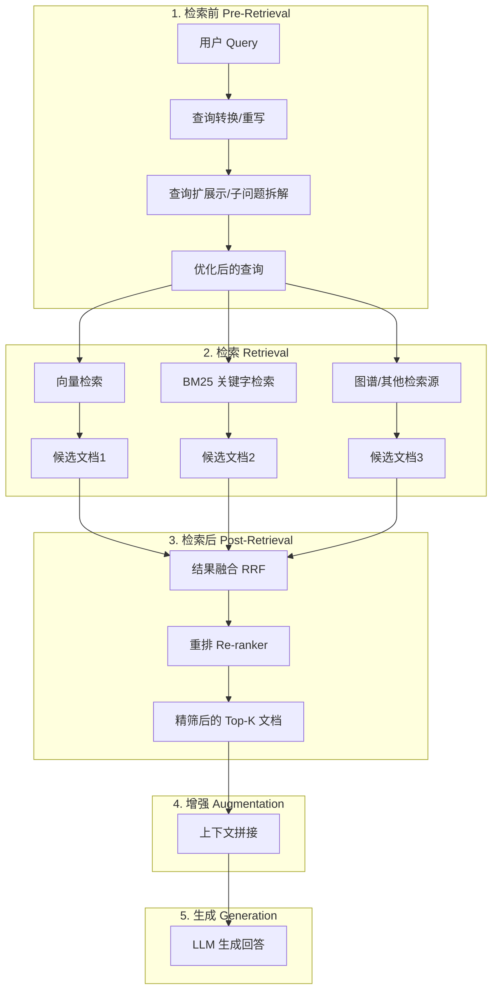
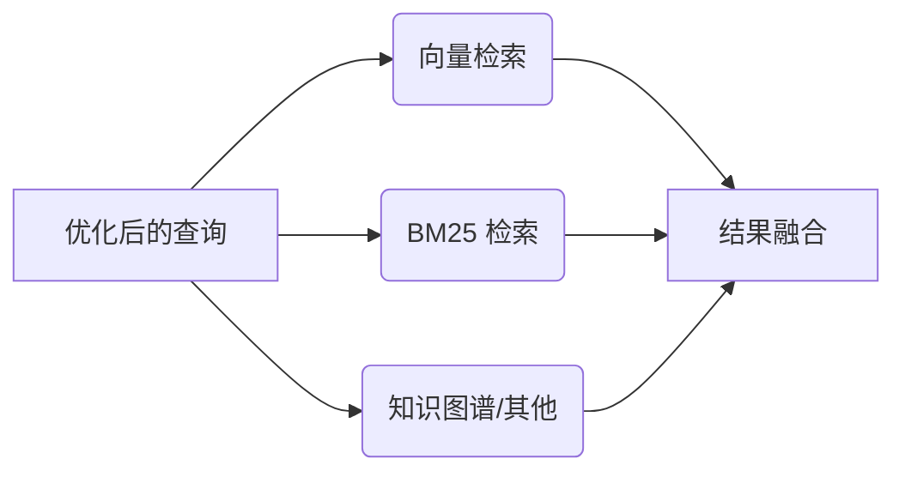

# Spring AI RAG Cookbook

## 为什么需要 RAG？

### 传统 LLM 的痛点

**1. 知识截止日期问题**

```
LLM 的训练数据有截止日期，无法获取最新信息。

例如：ChatGPT 的知识截止到 2023 年，无法回答 2024 年发生的事件。
```

**2. 幻觉问题**

```
LLM 可能生成不准确或不存在的信息（"幻觉"）。

例如：用户问"某产品的价格"，LLM 可能编造一个不存在的价格。
```

**3. 缺乏专业领域知识**

```
通用 LLM 可能不了解特定领域的专业知识。

例如：医疗、法律、金融等垂直领域的专业术语和知识。
```

**4. 无法引用来源**

```
传统 LLM 无法提供答案的依据和来源，用户难以验证回答的准确性。
```

### RAG 的解决方案

**RAG（Retrieval-Augmented Generation，检索增强生成）** 通过以下方式解决这些问题：

```
用户 Query --> 检索 --> 增强 --> 生成
                 |
                 v
         从真实文档中获取信息
```

---

## RAG 流程



---

## 1. 检索前（Pre-Retrieval）

在正式检索之前，对用户查询进行优化处理，提高检索的准确性和召回率。

### 1.1 查询转换（Query Transformation）

**解决的问题**：用户的口语化表达或复杂问题难以直接检索

| 技术 | 说明 | Spring AI 组件 |
|-----|------|---------------|
| **Query Rewriting** | LLM 将口语化问题转为标准检索语句 | `RewriteQueryTransformer` |
| **Query Decomposition** | 复杂问题拆解为多个子查询 | `QueryDecomposer` |
| **Query Compression** | 查询压缩（对话场景） | `CompressionQueryTransformer` |
| **Query Translation** | 多语言查询翻译 | `TranslationQueryTransformer` |

**示例**：
```
原始查询: "给我讲讲那个什么 Spring AI 的事儿"
重写后: "Spring AI 的核心特性和功能"
```

### 1.2 查询扩展示（Query Expansion）

**解决的问题**：单一查询的覆盖范围有限，可能遗漏重要信息

| 技术 | 说明 | Spring AI 组件 |
|-----|------|---------------|
| **Multi-Query Expansion** | 将单个查询扩展为多个相关查询 | `MultiQueryExpander` |

**示例**：
```
原查询: "Spring AI 的核心特性是什么？"
扩展查询1: "Spring AI 核心功能特性"
扩展查询2: "Spring AI Prompts API 介绍"
扩展查询3: "Spring AI 向量存储支持"
```

---

## 2. 检索（Retrieval）

从向量数据库中检索与查询相关的文档。

### 2.1 向量检索

```java
List<Document> documents = vectorStore.similaritySearch(query);
```

### 2.2 关键词检索（BM25）

```java
// 基于词频和逆文档频率的检索
SearchRequest request = SearchRequest.builder()
    .query(query)
    .topK(10)
    .build();
```

### 2.3 多路召回



---

## 3. 检索后（Post-Retrieval）

对检索结果进行后处理，提高最终返回文档的质量。

### 3.1 结果融合（Document Join）

**解决的问题**：多路召回产生大量候选文档，需要融合去重

| 技术 | 说明 | Spring AI 组件 |
|-----|------|---------------|
| **RRF 融合** | 倒数排名融合 | `DocumentJoiner` |
| **加权投票** | 按权重融合多路结果 | `WeightedDocumentJoiner` |
| **拼接连接** | 按顺序拼接多个结果 | `ConcatenationDocumentJoiner` |

**融合策略**：
```
向量检索权重 0.7 + BM25 权重 0.3 = 得分加权求和
```

### 3.2 重排（Re-ranking）

**解决的问题**：初步检索是"近似最近邻"，精度有限

| 技术 | 说明 | Spring AI 组件 |
|-----|------|---------------|
| **Cross-Encoder 重排** | 使用交叉编码器精细打分 | `CrossEncoderReranker` |
| **多样性重排** | 保证结果多样性 | `DocumentPostProcessor` |

**为什么需要重排？**
```
初步检索（向量检索）：速度快，但精度有限（近似最近邻）
重排：用更昂贵的模型做"精筛"，选出最相关的 top-K
```

---

## 4. 增强（Augmentation）

将处理后的文档与原始查询拼接，形成增强后的提示词。

```java
String augmentedPrompt = """
    基于以下上下文信息回答用户的问题。

    上下文信息：
    %s

    用户问题：%s
    """.formatted(context, query);
```

---

## 5. 生成（Generation）

LLM 基于增强后的提示词生成最终回答。

```java
String response = chatClient.prompt(augmentedPrompt).call().content();
```

---

## Naive RAG vs 高级 RAG

### Naive RAG（基础 RAG）

```
用户 Query --> 检索 --> 增强 --> 生成
```

**局限性**：
- 缺乏查询优化
- 单一检索通道
- 缺少重排环节
- 多样性和覆盖度不足

### 高级 RAG（Advanced RAG）

```
用户 Query --> 检索前优化 --> 多路检索 --> 检索后处理 --> 增强 --> 生成
                ↓              ↓            ↓
             查询转换       向量+BM25      重排
             查询扩展       知识图谱       融合
```

---

## Spring AI RAG 组件完整映射

### 检索前（Pre-Retrieval）

```
Spring AI 组件                              -->  RAG 概念
───────────────────────────────────────────────────────────────
RewriteQueryTransformer                -->  Query Rewriting（查询重写）
QueryDecomposer                       -->  Query Decomposition（查询分解）
CompressionQueryTransformer           -->  Query Compression（查询压缩）
TranslationQueryTransformer           -->  Query Translation（查询翻译）
MultiQueryExpander                    -->  Query Expansion（查询扩展）
```

### 检索（Retrieval）

```
Spring AI 组件                              -->  RAG 概念
───────────────────────────────────────────────────────────────
VectorStoreDocumentRetriever          -->  向量存储检索器
VectorStoreRetriever                  -->  向量相似度搜索接口
QuestionAnswerAdvisor                 -->  基础 RAG 顾问
```

### 检索后（Post-Retrieval）

```
Spring AI 组件                              -->  RAG 概念
───────────────────────────────────────────────────────────────
ConcatenationDocumentJoiner          -->  文档拼接连接
WeightedDocumentJoiner               -->  加权融合连接
CrossEncoderReranker                 -->  Cross-Encoder 重排
CohereReranker                       -->  第三方服务重排
```

### 增强与生成（Augmentation & Generation）

```
Spring AI 组件                              -->  RAG 概念
───────────────────────────────────────────────────────────────
RetrievalAugmentationAdvisor         -->  完整 RAG 管道
MessageChatMemoryAdvisor             -->  对话历史记忆
```

---

## 快速开始

### 1. Maven 依赖

```xml
<dependency>
    <groupId>org.springframework.ai</groupId>
    <artifactId>spring-ai-starter-model-openai</artifactId>
</dependency>
<dependency>
    <groupId>org.springframework.ai</groupId>
    <artifactId>spring-ai-vector-store</artifactId>
</dependency>
```

### 2. 配置（内存向量库，无需数据库）

```yaml
spring:
  ai:
    openai:
      base-url: https://dashscope.aliyuncs.com/compatible-mode
      api-key: ${QIANWEN_API_KEY}
    embedding:
      model: text-embedding-v3

server:
  port: 8080
```

### 3. 向量存储配置

```java
@Bean
public VectorStore simpleVectorStore(OpenAiEmbeddingModel embeddingModel) {
    return SimpleVectorStore.builder(embeddingModel).build();
}
```

**SimpleVectorStore 特点**：
- 数据存储在内存中（开发测试首选）
- 无需安装 PostgreSQL/PGVector
- 重启后数据会丢失
- 生产环境建议使用 PgVector、Milvus 等

### 4. 启动应用

```bash
mvn spring-boot:run
```

### 5. 访问示例端点

```bash
# Naive RAG - 基础 RAG 流程
curl "http://localhost:8080/rag/naive?query=Spring%20AI%20的核心特性是什么？"

# 检索前 - 查询重写
curl "http://localhost:8080/rag/transformation/rewrite?query=给我讲讲那个什么%20Spring%20AI%20的事儿"

# 检索前 - 查询分解
curl "http://localhost:8080/rag/transformation/decompose?query=Spring%20AI%20和传统%20Spring%20框架有什么关系？"

# 检索前 - 查询扩展示
curl "http://localhost:8080/rag/expansion/multi-query?query=Spring%20AI%20的核心特性是什么？"

# 检索 - 多路召回与融合
curl "http://localhost:8080/rag/join/multi-channel-fusion?query=Spring%20AI%20的核心特性是什么？"

# 检索后 - 重排
curl "http://localhost:8080/rag/rerank/basic?query=Spring%20AI%20的核心特性是什么？"

# 高级 RAG 完整流程
curl "http://localhost:8080/rag/rerank/complete-flow?query=Spring%20AI%20支持哪些功能？"
```

---

## API 端点说明

| 端点 | 流程阶段 | 功能描述 |
|-----|---------|---------|
| `/rag/naive` | 基础流程 | Naive RAG：检索→增强→生成 |
| `/rag/transformation/rewrite` | 检索前 | Query Rewriting：口语化转标准检索语句 |
| `/rag/transformation/decompose` | 检索前 | Query Decomposition：复杂问题拆分为子查询 |
| `/rag/expansion/multi-query` | 检索前 | Query Expansion：单查询扩展为多查询 |
| `/rag/join/multi-channel-fusion` | 检索 | Multi-Channel Fusion：多路召回结果融合 |
| `/rag/rerank/basic` | 检索后 | Re-ranking：精筛 top-K 文档 |
| `/rag/rerank/complete-flow` | 完整流程 | 高级 RAG 完整流程演示 |

---

## 最佳实践

### 1. 检索前策略

- 口语化查询 → 使用 Query Rewriting
- 复杂问题 → 使用 Query Decomposition
- 简单查询 → 使用 Query Expansion 提高召回率

### 2. 检索策略

- 向量检索：捕捉语义相似性
- 关键词检索：捕捉精确匹配
- 根据业务场景选择合适的检索组合

### 3. 检索后策略

- 候选文档数量不宜过多（通常 50-100）
- 使用 Cross-Encoder 进行精排
- 考虑多样性和相关性的平衡

### 4. 性能优化

- 使用异步处理提高并发能力
- 缓存高频查询的结果
- 合理设置向量索引参数

---

## 参考资料

- [Spring AI 官方文档 - RAG](https://docs.spring.io/spring-ai/reference/api/retrieval-augmented-generation.html)
