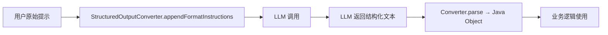

# 结构化输出转换器

## LLM 输出是“自由文本”，但程序需要“结构化数据”

想象你正在开发一个电影推荐助手，用户问：“Tom Hanks 演过哪些经典电影？”  
你调用大模型（LLM），它返回一段自然语言：

> “Tom Hanks 出演过《阿甘正传》、《拯救大兵瑞恩》、《费城故事》、《荒岛余生》和《菲利普斯船长》。”

这段话对人类很友好，但你的 Java 程序无法直接使用——你需要的是一个 `List<String>` 或一个包含 `actor` 和 `movies` 字段的 Java 对象。

**这就是核心问题**：
> LLM 天然输出自由文本，但下游业务逻辑需要可编程的结构化数据（如 JSON、Java Bean、Map、List）。

### 没有结构化输出转换器时，开发者怎么做？

1. **手动解析**：用正则表达式或字符串分割提取信息——脆弱、易出错。
2. **要求模型“尽量按格式输出”**：比如提示“请用 JSON 格式回答”，但模型可能：
    - 忘记用引号
    - 多加解释文字
    - 返回无效 JSON
3. **反复重试 + 后处理**：写一堆容错逻辑，代码又臭又长。

哈哈，以上问题相信有经验的开发者，在项目开发时都经历过。
这些问题无法靠“多写几行提示词”彻底解决——因为 LLM 本质是概率生成器，不是 JSON 引擎。
因此，我们需要一种能让大模型稳定按照我们要求的格式输出的转换技术。

于是，**Spring AI 提供了 `StructuredOutputConverter`**：一套标准化机制，在**提示阶段引导模型输出结构化文本**，并在**响应阶段自动转为 Java 对象**。

---

## 用 5 行代码将大模型结果转为 Java 对象

先看效果：我们让模型返回 Tom Hanks 的 5 部电影，并直接得到一个 `ActorsFilms` 记录对象。

### 步骤 1：在本模块添加依赖（仅需 Spring AI + OpenAI）

```xml
<dependency>
    <groupId>org.springframework.ai</groupId>
    <artifactId>spring-ai-starter-model-openai</artifactId>
    <version>${project.version}</version>
</dependency>
```

### 步骤 2：定义目标结构

```java
record ActorsFilms(String actor, List<String> movies) {}
```

### 步骤 3：一行调用，直接获取结构化结果

```java
ActorsFilms result = openAiChatClient.prompt()
    .prompt()
    .user("Generate the filmography of 5 movies for Tom Hanks.")
    .call()
    .entity(ActorsFilms.class); // ← 关键：指定目标类型

System.out.println(result.actor());   // "Tom Hanks"
System.out.println(result.movies());  // ["Forrest Gump", "Saving Private Ryan", ...]
```


> **运行效果**：程序直接拿到强类型的 `ActorsFilms` 实例，无需手动解析 JSON 字符串。

### 关键点分析

- `.entity(ActorsFilms.class)` 触发了 `BeanOutputConverter`。
- Spring AI 自动：
    1. 在提示词末尾追加格式指令（如：“请返回符合以下 JSON Schema 的响应……”）
    2. 调用模型
    3. 将返回的 JSON 字符串反序列化为 `ActorsFilms` 对象

> 💡 **不这样做会怎样？**  
> 如果你只用 `.call().content()`，你会得到一整段自由文本，还得自己写解析逻辑——而模型可能今天返回 JSON，明天返回 Markdown 列表。

---

## 用“格式契约”桥接 LLM 与程序

`StructuredOutputConverter` 的设计灵感来自 **前后端 API 契约**：

- 前端告诉后端：“我期望你返回 `{ "name": "string", "age": number }`”
- 后端遵守契约，前端直接解析

在 LLM 场景中：

| 角色 | 传统 API | LLM + StructuredOutputConverter |
|------|--------|-------------------------------|
| 请求方 | 客户端 | Spring AI（通过 `FormatProvider`） |
| 响应方 | 服务端 | 大模型（如 OpenAI） |
| 契约 | OpenAPI/Swagger | JSON Schema / 格式指令 |
| 解析器 | Jackson/Gson | `ObjectMapper` / `ConversionService` |

### 工作流程



1. **前处理**：转换器将格式指令（如 JSON Schema）拼接到提示词末尾。
2. **模型调用**：LLM 收到带格式要求的完整提示。
3. **后处理**：转换器将模型输出解析为目标类型（Bean/Map/List）。

> 🎯 **设计动机**：  
> 不是让开发者“猜模型怎么输出”，而是**主动约束输出格式**，并提供自动化解析——把不可靠的文本生成变成可靠的结构化数据管道。

---

## 三种内置转换器详解

Spring AI 提供三种开箱即用的转换器，覆盖 90% 场景。

### 1. `BeanOutputConverter`：映射到 Java 类/记录

适用于：需要强类型对象的场景（如 DTO、领域模型）。

#### 示例：带泛型的复杂结构

```java
List<ActorsFilms> films = openAiChatClient.prompt()
    .prompt()
    .user("List 3 movies each for Tom Hanks and Julia Roberts.")
    .call()
    .entity(new ParameterizedTypeReference<List<ActorsFilms>>() {});
```

> ⚠️ 注意：必须用 `ParameterizedTypeReference` 保留泛型信息，否则 Jackson 无法反序列化。

#### 控制字段顺序

通过 `@JsonPropertyOrder` 确保 JSON Schema 字段顺序一致：

```java
@JsonPropertyOrder({"actor", "movies"})
record ActorsFilms(String actor, List<String> movies) {}
```

这对某些严格校验 Schema 的模型（如 OpenAI Structured Outputs）很重要。

---

### 2. `MapOutputConverter`：灵活的键值对

适用于：输出结构不确定，或只需临时数据容器。

```java
Map<String, Object> result = ChatClient.create(chatModel)
    .prompt()
    .user("Return user info: name=Alice, age=30, active=true")
    .call()
    .entity(new ParameterizedTypeReference<Map<String, Object>>() {});

String name = (String) result.get("name"); // "Alice"
```

底层使用 RFC8259 JSON 格式指令，确保模型返回合法 JSON。

---

### 3. `ListOutputConverter`：纯列表输出

适用于：模型只需返回一维列表（如关键词、选项、ID 列表）。

```java
List<String> flavors = openAiChatClient.prompt()
    .prompt()
    .user("List five ice cream flavors")
    .call()
    .entity(new ListOutputConverter(new DefaultConversionService()));
```

格式指令会提示模型：“返回逗号分隔的列表，不要编号、不要解释”。

> 🔧 **自定义分隔符？**  
> 当前版本固定为逗号分隔。如需其他格式（如换行），需继承 `ListOutputConverter` 并重写 `getFormat()`。

---

## 原生结构化输出能力

随着越来越多 AI 模型（如 OpenAI、Azure OpenAI、Mistral）**原生支持结构化输出**，你可以通过启用 `AdvisorParams.ENABLE_NATIVE_STRUCTURED_OUTPUT` 参数，让 Spring AI 自动使用模型的原生能力，而不是依赖提示词引导。

### 启用方式

#### 方式一：单次调用启用

```java
ActorFilms actorFilms = openAiChatClient.prompt()
    .advisors(AdvisorParams.ENABLE_NATIVE_STRUCTURED_OUTPUT)
    .user("Generate the filmography for a random actor.")
    .call()
    .entity(ActorFilms.class);
```

#### 方式二：全局启用（所有调用生效）

```java
ChatClient openAiChatClient = ChatClient.builder(chatModel)
    .defaultAdvisors(AdvisorParams.ENABLE_NATIVE_STRUCTURED_OUTPUT)
    .build();
```

> **优势**：  
> 原生结构化输出由模型内部强制执行，**可靠性远高于仅靠提示词约束**，尤其适合生产环境。
> 
>⚠️ **注意** ：`AdvisorParams.ENABLE_NATIVE_STRUCTURED_OUTPUT` 在 Spring AI Stable 1.1.2 以上版本中提供

### 重要限制：并非所有结构都支持

**某些模型（如 OpenAI）原生不支持“对象数组”（array of objects）**。例如：

```json
[
  { "actor": "Tom", "movies": [...] },
  { "actor": "Julia", "movies": [...] }
]
```

在这种情况下，即使启用了原生结构化输出，模型也可能失败或回退到自由文本。

**解决方案**：  
此时应**关闭原生模式**，改用 Spring AI 默认的结构化输出转换器（基于提示词 + 后处理），它能通过更灵活的格式指令引导模型生成有效 JSON。

```java
// 不启用原生模式，依赖默认转换器
List<ActorFilms> result = openAiChatClient.prompt()
    .user("List filmographies for Tom Hanks and Julia Roberts.")
    .call()
    .entity(new ParameterizedTypeReference<List<ActorFilms>>() {});
```

> 📌 **最佳实践**：
> - 单对象 → 优先启用 `ENABLE_NATIVE_STRUCTURED_OUTPUT`
> - 对象数组 / 复杂嵌套 → 使用默认转换器（不启用原生）

---

## 风险与注意事项

### 1. 模型不一定听话

即使加了格式指令，某些模型（尤其开源小模型）仍可能：
- 返回带解释的文本（如：“好的，这是你要的 JSON：{...}”）
- 生成语法错误的 JSON

**应对策略**：
- 使用支持 **原生 JSON 模式** 的模型（见下表）
- 添加后置验证（如 try-catch + 重试）

### 2. 哪些模型支持“强结构化输出”？

| 模型 | 是否支持强制 JSON | 配置方式 |
|------|------------------|--------|
| OpenAI | ✅ | `responseFormat = { "type": "json_object" }` |
| Azure OpenAI | ✅ | 同上 |
| Mistral AI | ✅ | 同上 |
| Ollama | ✅（仅 JSON） | `format = "json"` |
| Anthropic / VertexAI | ❌（依赖提示词） | 仅靠格式指令 |

> 📌 **建议**：生产环境优先选择支持原生 JSON 模式的模型，可靠性更高。

### 3. 不要用于 Tool Calling 场景

如果你使用 **Function Calling / Tool Calling**，模型输出本身就是结构化的（函数名+参数），此时**不需要** `StructuredOutputConverter`。

---

## 总结：何时使用结构化输出转换器？

| 场景 | 推荐方案 |
|------|--------|
| 需要将 LLM 自由文本转为 Java 对象 | ✅ `BeanOutputConverter` |
| 输出结构简单、临时使用 | ✅ `MapOutputConverter` |
| 只需一维列表 | ✅ `ListOutputConverter` |
| 模型支持原生 JSON 且结构为单对象 | ✅ 启用 `ENABLE_NATIVE_STRUCTURED_OUTPUT` |
| 需要对象数组（如 `List<ActorFilms>`） | ✅ **禁用** 原生模式，用默认转换器 |
| 已使用 Tool Calling | ❌ 不需要 |

> 🎁 **最佳实践**：  
> 即使模型支持 JSON 模式，也建议配合 `StructuredOutputConverter` —— 它不仅提供格式指令，还封装了解析逻辑，让代码更简洁、可维护。

---

## 引用

- [官方文档：Structured Output Converter](https://docs.spring.io/spring-ai/reference/api/structured-output-converter.html)
- [Structured model outputs | OpenAI API](https://platform.openai.com/docs/guides/structured-outputs)
