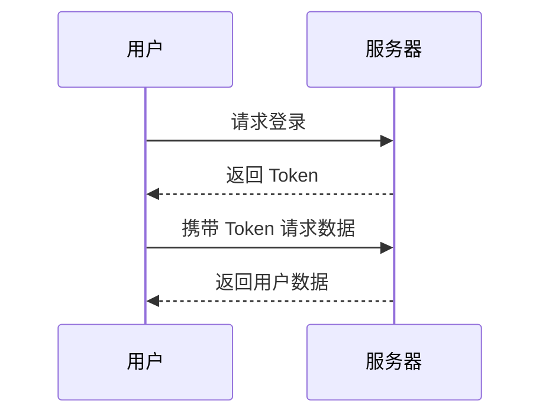

[[0.spring-ai-introduction/index|Spring AI 简介]]

::: timeline 2023-05-24

- **do some thing1**
- do some thing2
  :::

::: timeline 2023-05-23
do some thing3
do some thing4
:::

::: code-group

```sh [npm]
npm install vitepress-plugin-group-icons
```

```sh [yarn]
yarn add vitepress-plugin-group-icons
```

```sh [pnpm]
pnpm add vitepress-plugin-group-icons
```

```sh [bun]
bun add vitepress-plugin-group-icons
```

:::

```js [vite.config.js]
import legacy from '@vitejs/plugin-legacy'
import { defineConfig } from 'vite'

export default defineConfig({
  plugins: [
    legacy({
      targets: ['defaults', 'not IE 11'],
    }),
  ],
})
```

```json [.json]
{
  "name": "publishBlog",
  "parameters": {
    "type": "object",
    "properties": {
      "title": {"type": "string"},
      "content": {"type": "string"},
      "tags": {"type": "array", "items": {"type": "string"}}
    },
    "required": ["title", "content"]
  }
}
```

```java [java]
public class HelloWorld {}
```

```xml [xml]
```

```markmap
# 前端面试
## HTML
- 语义化标签
- SEO 优化
## CSS
- Flex 布局
- Grid 布局
## JavaScript
- 闭包
- 事件循环
```



## https://vitepress.yiov.top/markdown.html

### Badge组件

* VitePress <Badge type="info" text="default" />
* VitePress <Badge type="tip" text="^1.9.0" />
* VitePress <Badge type="warning" text="beta" />
* VitePress <Badge type="danger" text="caution" />

### 聚焦代码

```ts{4}
export default defineConfig({
  lang: 'zh-CN',
  title: "VitePress",
  description: "我的vitpress文档教程", // [!code focus]
  titleTemplate: '另起标题覆盖title' ,
})
```


