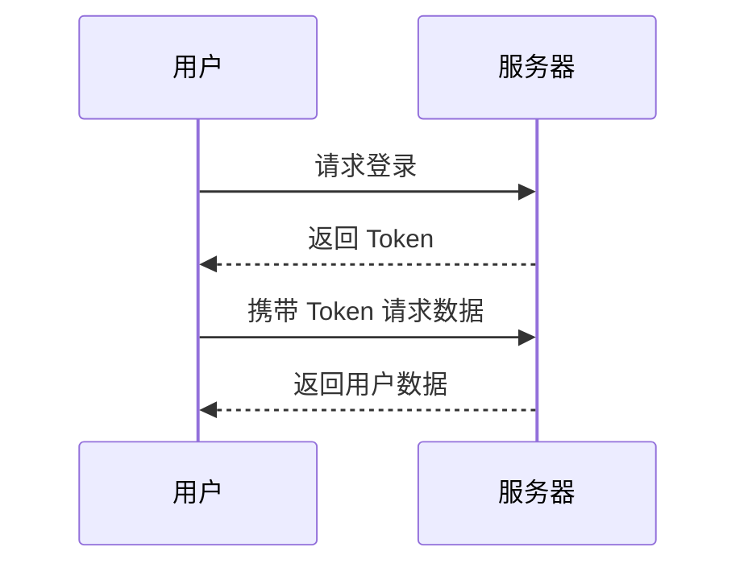

# Spring AI Cookbook 文档

基于 VitePress 的 Spring AI 教程文档站点。

## 快速开始

### 安装依赖

```bash [bash]
npm install
```

### 开发模式

```bash [bash]
npm run dev
```

访问 `http://localhost:5173` 查看文档。

### 构建文档

```bash [bash]
npm run build
```

构建后的文件在 `.vitepress/dist` 目录。

### 预览构建结果

```bash [bash]
npm run preview
```

## 同步文档

当子模块的 README.md 或图片资源更新后，需要同步到 docs 目录：

```bash [bash]
npm run sync
# 或者
bash sync-docs.sh
```

同步脚本会自动：

- 复制 README.md 到对应的 `index.md`
- 复制 `imgs/` 目录下的所有图片资源
- 保持相对路径不变（`./imgs/xxx.webp` 在 VitePress 中能正常显示）

## 文档结构

- `index.md` - 首页
- `*.spring-ai-*/index.md` - 各模块文档（从子模块 README.md 同步）
- `*.spring-ai-*/imgs/` - 各模块的图片资源（从子模块 imgs 目录同步）

## 多层级模块支持

脚本支持多层级子模块结构，例如：

```
7.spring-ai-model-chat/
  ├── README.md
  └── 7.1.spring-ai-model-chat-openai/
      └── README.md
```

会自动同步为：

```
docs/
  └── 7.spring-ai-model-chat/
      ├── index.md
      └── 7.1.spring-ai-model-chat-openai/
          └── index.md
```

## 部署

文档部署到 `springai.dong4j.site` 域名。

### 部署步骤

1. 构建文档：`npm run docs:build`
2. 将 `docs/.vitepress/dist` 目录内容部署到服务器
3. 配置 Nginx 或其他 Web 服务器指向该目录

## 配置说明

- `.vitepress/config.js` - VitePress 配置文件
- `sync-docs.sh` - 文档同步脚本
- `generate-sidebar.js` - 侧边栏生成脚本（可选）

## 代码图标

### 使用方式

```js [vite.config.js]
import legacy from '@vitejs/plugin-legacy'
import { defineConfig } from 'vite'

export default defineConfig({
  plugins: [
    legacy({
      targets: ['defaults', 'not IE 11'],
    }),
  ],
})
```

### 图标映射

```javascript
export const builtinIcons = {
  // package managers
  'pnpm': 'vscode-icons:file-type-light-pnpm',
  'npm': 'vscode-icons:file-type-npm',
  'yarn': 'vscode-icons:file-type-yarn',
  'bun': 'vscode-icons:file-type-bun',
  'deno': 'vscode-icons:file-type-deno',
  // frameworks
  'vue': 'vscode-icons:file-type-vue',
  'svelte': 'vscode-icons:file-type-svelte',
  'angular': 'vscode-icons:file-type-angular',
  'react': 'vscode-icons:file-type-reactjs',
  'next': 'vscode-icons:file-type-light-next',
  'nuxt': 'vscode-icons:file-type-nuxt',
  'solid': 'logos:solidjs-icon',
  'astro': 'vscode-icons:file-type-light-astro',
  'qwik': 'logos:qwik-icon',
  'ember': 'vscode-icons:file-type-ember',
  // bundlers
  'rollup': 'vscode-icons:file-type-rollup',
  'webpack': 'vscode-icons:file-type-webpack',
  'vite': 'vscode-icons:file-type-vite',
  'esbuild': 'vscode-icons:file-type-esbuild',
  // configuration files
  'package.json': 'vscode-icons:file-type-node',
  'tsconfig.json': 'vscode-icons:file-type-tsconfig',
  '.npmrc': 'vscode-icons:file-type-npm',
  '.editorconfig': 'vscode-icons:file-type-editorconfig',
  '.eslintrc': 'vscode-icons:file-type-eslint',
  '.eslintignore': 'vscode-icons:file-type-eslint',
  'eslint.config': 'vscode-icons:file-type-eslint',
  '.gitignore': 'vscode-icons:file-type-git',
  '.gitattributes': 'vscode-icons:file-type-git',
  '.env': 'vscode-icons:file-type-dotenv',
  '.env.example': 'vscode-icons:file-type-dotenv',
  '.vscode': 'vscode-icons:file-type-vscode',
  'tailwind.config': 'vscode-icons:file-type-tailwind',
  'uno.config': 'vscode-icons:file-type-unocss',
  'unocss.config': 'vscode-icons:file-type-unocss',
  '.oxlintrc': 'vscode-icons:file-type-oxlint',
  'vue.config': 'vscode-icons:file-type-vueconfig',
  // filename extensions
  '.mts': 'vscode-icons:file-type-typescript',
  '.cts': 'vscode-icons:file-type-typescript',
  '.ts': 'vscode-icons:file-type-typescript',
  '.tsx': 'vscode-icons:file-type-typescript',
  '.mjs': 'vscode-icons:file-type-js',
  '.cjs': 'vscode-icons:file-type-js',
  '.json': 'vscode-icons:file-type-json',
  '.js': 'vscode-icons:file-type-js',
  '.jsx': 'vscode-icons:file-type-js',
  '.md': 'vscode-icons:file-type-markdown',
  '.py': 'vscode-icons:file-type-python',
  '.ico': 'vscode-icons:file-type-favicon',
  '.html': 'vscode-icons:file-type-html',
  '.css': 'vscode-icons:file-type-css',
  '.scss': 'vscode-icons:file-type-scss',
  '.yml': 'vscode-icons:file-type-light-yaml',
  '.yaml': 'vscode-icons:file-type-light-yaml',
  '.php': 'vscode-icons:file-type-php',
  '.gjs': 'vscode-icons:file-type-glimmer',
  '.gts': 'vscode-icons:file-type-glimmer',
}
```

## vitepress-plugin-legend

### 使用方式

```markmap
# 前端面试
## HTML
- 语义化标签
- SEO 优化
## CSS
- Flex 布局
- Grid 布局
## JavaScript
- 闭包
- 事件循环
```



## 徽章

#### 后端技术栈

<p>
  
  
  
  
  
  
  
  
  
  
  
  
  
  
  
  
  
  
  
  
  
  
  
  
  
  
  
  
  
  
</p>

#### 前端技术栈

<p>
  
  
  
  
  
  
  
  
  
  
  
  
  
  
  
  
  
</p>

#### DevOps

<p>
  
  
  
  
  
  
  
  
  
  
  
  
</p>

#### 运维技术栈

<p>
  
  
  
  
  
  
  
</p>

#### 测试技术栈

<p>
  
  
</p>

#### 开发工具

<p>
  
  
  
  
  
  
</p>

#### 其他

<p>
  
  
  
  
</p>

## GitHub风格警报

> [!提醒] 重要
> 强调用户在快速浏览文档时也不应忽略的重要信息。

> [!建议]
> 有助于用户更顺利达成目标的建议性信息。

> [!重要]
> 对用户达成目标至关重要的信息。

> [!警告]
> 因为可能存在风险，所以需要用户立即关注的关键内容。

> [!注意]
> 行为可能带来的负面影响。

## Badge组件

* VitePress <Badge type="info" text="default" />
* VitePress <Badge type="tip" text="^1.9.0" />
* VitePress <Badge type="warning" text="beta" />
* VitePress <Badge type="danger" text="caution" />

## 表情

https://www.emojiall.com/zh-hans
