# Spring AI Cookbook 文档

基于 VitePress 的 Spring AI 教程文档站点。

## 快速开始

### 安装依赖

```bash [bash]
npm install
```

### 开发模式

```bash [bash]
npm run dev
```

访问 `http://localhost:5173` 查看文档。

### 构建文档

```bash [bash]
npm run build
```

构建后的文件在 `.vitepress/dist` 目录。

### 预览构建结果

```bash [bash]
npm run preview
```

## 同步文档

当子模块的 README.md 或图片资源更新后，需要同步到 docs 目录：

```bash [bash]
npm run sync
# 或者
bash sync-docs.sh
```

同步脚本会自动：

- 复制 README.md 到对应的 `index.md`
- 复制 `imgs/` 目录下的所有图片资源
- 保持相对路径不变（`./imgs/xxx.webp` 在 VitePress 中能正常显示）

## 文档结构

- `index.md` - 首页
- `guide/` - 简介相关文档目录
- `*.spring-ai-*/index.md` - 各模块文档（从子模块 README.md 同步）
- `*.spring-ai-*/imgs/` - 各模块的图片资源（从子模块 imgs 目录同步）

## Guide 目录多文档菜单

`guide` 目录支持多个文档文件，所有文档会自动显示在侧边栏的"简介"菜单下。

### 文件命名规则

在 `guide` 目录下创建文档时，使用编号前缀来控制菜单顺序：

- `index.md` - 主文档，链接为 `/guide/`，始终排在最前面
- `1.introduction.md` - 编号文档，链接为 `/guide/1.introduction`，按编号排序
- `2.quick-start.md` - 编号文档，链接为 `/guide/2.quick-start`，按编号排序
- `3.resources.md` - 编号文档，链接为 `/guide/3.resources`，按编号排序
- `other.md` - 无编号文档，链接为 `/guide/other`，排在所有编号文档之后

### 目录结构示例

```
docs/guide/
├── index.md              # Spring AI 简介 (排序: 0, 链接: /guide/)
├── 1.introduction.md     # 简介 (排序: 1, 链接: /guide/1.introduction)
├── 2.quick-start.md      # 快速上手 (排序: 2, 链接: /guide/2.quick-start)
├── 3.resources.md        # 资源汇总 (排序: 3, 链接: /guide/3.resources)
└── imgs/                 # 图片资源目录
    └── example.webp
```

### 菜单显示规则

1. **菜单文本**：自动使用文档的一级标题（`#` 后的内容）作为菜单项文本
2. **排序规则**：
    - `index.md` 始终排在最前面（sortKey: 0）
    - 编号文档按数字从小到大排序（如 1, 2, 3...）
    - 无编号文档排到最后（sortKey: 9999）
3. **链接生成**：
    - `index.md` → `/guide/`
    - `1.introduction.md` → `/guide/1.introduction`
    - `2.quick-start.md` → `/guide/2.quick-start`

### 示例

侧边栏中的"简介"菜单将显示：

```
简介
  ├─ Spring AI 简介        (来自 index.md)
  ├─ 简介                  (来自 1.introduction.md)
  ├─ 快速上手              (来自 2.quick-start.md)
  └─ 资源汇总              (来自 3.resources.md)
```

### 注意事项

- 文档的一级标题（`# 标题`）将作为菜单项文本
- 文件名中的编号用于排序，不会出现在链接中
- 所有图片资源建议放在 `guide/imgs/` 目录下，使用 WebP 格式

## 模块 docs 目录多文档菜单

模块的 `docs/` 目录（如 `1.spring-ai-started/docs/`）支持多个文档文件，这些文档会自动显示在对应模块的子菜单中。

### 文件命名规则

在模块的 `docs/` 目录下创建文档时，使用编号前缀来控制菜单顺序：

- `1.文件名.md` - 编号文档，链接为 `/模块名/1.文件名`，按编号排序
- `2.文件名.md` - 编号文档，链接为 `/模块名/2.文件名`，按编号排序
- `文件名.md` - 无编号文档，链接为 `/模块名/文件名`，排在所有编号文档之后

### 目录结构示例

```
1.spring-ai-started/
├── README.md              # 主教程（同步为 index.md）
├── docs/                  # 扩展文档目录
│   ├── 1.StringTemplate.md    # StringTemplate 详解 (排序: 1)
│   └── 2.Advanced.md          # 高级用法 (排序: 2)
└── imgs/                  # 图片资源
    └── example.webp
```

同步后自动生成到 docs 目录：

```
docs/1.spring-ai-started/
├── index.md               # 从 README.md 同步而来
├── 1.StringTemplate.md    # 从 docs/1.StringTemplate.md 同步而来
├── 2.Advanced.md          # 从 docs/2.Advanced.md 同步而来
└── imgs/                  # 图片自动复制
```

### 菜单显示规则

1. **菜单文本**：自动使用文档的一级标题（`#` 后的内容）作为菜单项文本
2. **排序规则**：
    - 编号文档按数字从小到大排序（如 1, 2, 3...）
    - 无编号文档排到最后（sortKey: 9999）
3. **链接生成**：
    - `1.StringTemplate.md` → `/1.spring-ai-started/1.StringTemplate`
    - `2.Advanced.md` → `/1.spring-ai-started/2.Advanced`

### 示例

侧边栏中的模块菜单将显示：

```
入门
  └─ Spring AI 快速开始
      ├─ StringTemplate        (来自 docs/1.StringTemplate.md)
      └─ Advanced             (来自 docs/2.Advanced.md)
```

### 注意事项

- 文档的一级标题（`# 标题`）将作为菜单项文本
- 文件名中的编号用于排序，会保留在链接中（如 `/1.spring-ai-started/1.StringTemplate`）
- 所有图片资源建议放在模块的 `imgs/` 目录下，使用 WebP 格式
- 这些文档与主教程（`index.md`）同级显示，优先级低于数字子模块

## 如何新增目录和文档

### 两种目录类型

文档目录分为两种类型：

#### 1. 以数字开头的目录（自动同步）

目录名以数字开头（如 `1.spring-ai-started`、`2.spring-ai-chat-client`），这些目录会从**源码目录**自动同步到 `docs/` 目录。

**特点**：

- 📁 文档位置：源码目录下的 `README.md`（如 `1.spring-ai-started/README.md`）
- 🔄 同步方式：运行 `npm run sync` 或 `bash sync-docs.sh` 自动同步
- 📋 菜单生成：自动根据模块编号分类到对应的菜单（如"入门"、"核心功能"等）
- ✏️ 维护方式：**只需修改源码目录中的 `README.md`**，然后同步即可

**示例**：

```bash
# 源码目录结构
1.spring-ai-started/
├── README.md          # 在这里编写文档
└── imgs/              # 图片资源
    └── example.webp

# 同步后自动生成到 docs 目录
docs/
└── 1.spring-ai-started/
    ├── index.md       # 从 README.md 同步而来
    └── imgs/          # 图片自动复制
```

> [!重要] 注意事项
> - **不要直接在 `docs/` 目录下修改以数字开头的目录**，修改会被同步脚本覆盖
> - 只需修改源码目录中的 `README.md`，然后运行同步脚本即可

#### 2. 非数字开头的目录（手动维护）

目录名不以数字开头（如 `guide`、`about`），这些目录需要在 `docs/` 目录下**手动维护**。

**特点**：

- 📁 文档位置：直接在 `docs/` 目录下（如 `docs/guide/index.md`）
- 🔄 同步方式：手动创建和编辑文档
- 📋 菜单生成：需要在 `config.js` 中使用 `addDirectoryMenu()` 函数添加
- ✏️ 维护方式：**直接在 `docs/` 目录下创建和编辑文档**

**已支持的目录**：

- `guide/` - 简介相关文档
- `about/` - 关于项目文档

### 如何新增非数字开头的目录

假设你想新增一个 `action`（实战）目录，步骤如下：

#### 步骤 1: 创建目录和文档

在 `docs/` 目录下创建新目录和文档：

```bash
docs/action/
├── index.md              # 主文档（必须）
├── 1.setup.md           # 环境搭建
├── 2.implementation.md  # 实现细节
└── imgs/                # 图片资源（可选）
    └── example.webp
```

#### 步骤 2: 在 `config.js` 中添加菜单

编辑 `docs/.vitepress/config.js` 文件，在 `generateSidebar()` 函数中添加一行代码：

```javascript
function generateSidebar() {
  ...

  // 在最后添加"关于"菜单
  addDirectoryMenu(sidebar, '关于', 'about')
  
  // 添加新的"实战"菜单
  addDirectoryMenu(sidebar, '实战', 'action')  // 👈 添加这一行

  return sidebar
}
```

#### 步骤 3: 文档命名规则

非数字开头的目录支持多文档，命名规则如下：

- `index.md` - 主文档，链接为 `/目录名/`，始终排在最前面
- `1.文件名.md` - 编号文档，链接为 `/目录名/1.文件名`，按编号排序
- `2.文件名.md` - 编号文档，链接为 `/目录名/2.文件名`，按编号排序
- `文件名.md` - 无编号文档，链接为 `/目录名/文件名`，排在所有编号文档之后

**示例**：

```
docs/action/
├── index.md              # 项目实战 (链接: /action/)
├── 1.setup.md           # 环境搭建 (链接: /action/1.setup)
├── 2.implementation.md  # 实现细节 (链接: /action/2.implementation)
└── imgs/
    └── example.webp
```

#### 步骤 4: 菜单显示

菜单会自动：

- 使用文档的一级标题（`# 标题`）作为菜单项文本
- 按编号自动排序（`index.md` 排最前，编号文档按数字排序）
- 如果目录不存在或没有文档，菜单不会显示

### 重要说明

> [!警告] `categoryOrder` 不要修改
>
> `categoryOrder` 数组是根据源码目录中的模块编号**自动分类**生成的，不需要手动修改。当你创建新的数字开头目录（如 `1.spring-ai-started`）时，系统会自动根据编号将其分类到对应的菜单中。

> [!重要] 目录类型区分
>
> - **以数字开头的目录**（如 `1.spring-ai-started`）：从源码目录自动同步，只需修改源码中的 `README.md`，然后运行同步脚本
> - **非数字开头的目录**（如 `guide`、`about`）：在 `docs/` 目录下手动维护，需要修改文档时直接编辑 `docs/` 目录下的文件

**菜单生成逻辑**：

- 数字开头目录：根据编号自动分类（1-2：入门，3-5：核心功能，6-13：Model API，14-18：高级功能，其他：部署与测试）
- 非数字开头目录：需要在 `generateSidebar()` 中使用 `addDirectoryMenu()` 手动添加

**菜单顺序**：
菜单的显示顺序就是 `addDirectoryMenu()` 函数的执行顺序。例如：

1. `addDirectoryMenu(sidebar, '简介', 'guide')` - 显示在最前面
2. 然后是自动生成的分类菜单
3. `addDirectoryMenu(sidebar, '关于', 'about')` - 显示在最后
4. `addDirectoryMenu(sidebar, '实战', 'action')` - 如果添加，会显示在"关于"之后

## 多层级模块支持

脚本支持多层级子模块结构，例如：

```
7.spring-ai-model-chat/
  ├── README.md
  └── 7.1.spring-ai-model-chat-openai/
      └── README.md
```

会自动同步为：

```
docs/
  └── 7.spring-ai-model-chat/
      ├── index.md
      └── 7.1.spring-ai-model-chat-openai/
          └── index.md
```

## 部署

文档部署到 `springai.dong4j.site` 域名。

### 部署步骤

1. 构建文档：`npm run docs:build`
2. 将 `docs/.vitepress/dist` 目录内容部署到服务器
3. 配置 Nginx 或其他 Web 服务器指向该目录

## 配置说明

- `.vitepress/config.js` - VitePress 配置文件
- `sync-docs.sh` - 文档同步脚本
- `generate-sidebar.js` - 侧边栏生成脚本（可选）

## 代码图标

### 使用方式

```js [vite.config.js]
import legacy from '@vitejs/plugin-legacy'
import { defineConfig } from 'vite'

export default defineConfig({
  plugins: [
    legacy({
      targets: ['defaults', 'not IE 11'],
    }),
  ],
})
```

### 图标映射

```javascript
export const builtinIcons = {
  // package managers
  'pnpm': 'vscode-icons:file-type-light-pnpm',
  'npm': 'vscode-icons:file-type-npm',
  'yarn': 'vscode-icons:file-type-yarn',
  'bun': 'vscode-icons:file-type-bun',
  'deno': 'vscode-icons:file-type-deno',
  // frameworks
  'vue': 'vscode-icons:file-type-vue',
  'svelte': 'vscode-icons:file-type-svelte',
  'angular': 'vscode-icons:file-type-angular',
  'react': 'vscode-icons:file-type-reactjs',
  'next': 'vscode-icons:file-type-light-next',
  'nuxt': 'vscode-icons:file-type-nuxt',
  'solid': 'logos:solidjs-icon',
  'astro': 'vscode-icons:file-type-light-astro',
  'qwik': 'logos:qwik-icon',
  'ember': 'vscode-icons:file-type-ember',
  // bundlers
  'rollup': 'vscode-icons:file-type-rollup',
  'webpack': 'vscode-icons:file-type-webpack',
  'vite': 'vscode-icons:file-type-vite',
  'esbuild': 'vscode-icons:file-type-esbuild',
  // configuration files
  'package.json': 'vscode-icons:file-type-node',
  'tsconfig.json': 'vscode-icons:file-type-tsconfig',
  '.npmrc': 'vscode-icons:file-type-npm',
  '.editorconfig': 'vscode-icons:file-type-editorconfig',
  '.eslintrc': 'vscode-icons:file-type-eslint',
  '.eslintignore': 'vscode-icons:file-type-eslint',
  'eslint.config': 'vscode-icons:file-type-eslint',
  '.gitignore': 'vscode-icons:file-type-git',
  '.gitattributes': 'vscode-icons:file-type-git',
  '.env': 'vscode-icons:file-type-dotenv',
  '.env.example': 'vscode-icons:file-type-dotenv',
  '.vscode': 'vscode-icons:file-type-vscode',
  'tailwind.config': 'vscode-icons:file-type-tailwind',
  'uno.config': 'vscode-icons:file-type-unocss',
  'unocss.config': 'vscode-icons:file-type-unocss',
  '.oxlintrc': 'vscode-icons:file-type-oxlint',
  'vue.config': 'vscode-icons:file-type-vueconfig',
  // filename extensions
  '.mts': 'vscode-icons:file-type-typescript',
  '.cts': 'vscode-icons:file-type-typescript',
  '.ts': 'vscode-icons:file-type-typescript',
  '.tsx': 'vscode-icons:file-type-typescript',
  '.mjs': 'vscode-icons:file-type-js',
  '.cjs': 'vscode-icons:file-type-js',
  '.json': 'vscode-icons:file-type-json',
  '.js': 'vscode-icons:file-type-js',
  '.jsx': 'vscode-icons:file-type-js',
  '.md': 'vscode-icons:file-type-markdown',
  '.py': 'vscode-icons:file-type-python',
  '.ico': 'vscode-icons:file-type-favicon',
  '.html': 'vscode-icons:file-type-html',
  '.css': 'vscode-icons:file-type-css',
  '.scss': 'vscode-icons:file-type-scss',
  '.yml': 'vscode-icons:file-type-light-yaml',
  '.yaml': 'vscode-icons:file-type-light-yaml',
  '.php': 'vscode-icons:file-type-php',
  '.gjs': 'vscode-icons:file-type-glimmer',
  '.gts': 'vscode-icons:file-type-glimmer',
}
```

## vitepress-plugin-legend

### 使用方式

```markmap
# 前端面试
## HTML
- 语义化标签
- SEO 优化
## CSS
- Flex 布局
- Grid 布局
## JavaScript
- 闭包
- 事件循环
```



```mermaid
sequenceDiagram
    participant U as 用户
    participant S as 服务器
    U->>S: 请求登录
    S-->>U: 返回 Token
    U->>S: 携带 Token 请求数据
    S-->>U: 返回用户数据
```

## 徽章

#### 后端技术栈

<p>
  
  
  
  
  
  
  
  
  
  
  
  
  
  
  
  
  
  
  
  
  
  
  
  
  
  
  
  
  
  
</p>

#### 前端技术栈

<p>
  
  
  
  
  
  
  
  
  
  
  
  
  
  
  
  
  
</p>

#### DevOps

<p>
  
  
  
  
  
  
  
  
  
  
  
  
</p>

#### 运维技术栈

<p>
  
  
  
  
  
  
  
</p>

#### 测试技术栈

<p>
  
  
</p>

#### 开发工具

<p>
  
  
  
  
  
  
</p>

#### 其他

<p>
  
  
  
  
</p>

## GitHub风格警报

> [!提醒] 重要
> 强调用户在快速浏览文档时也不应忽略的重要信息。

> [!建议]
> 有助于用户更顺利达成目标的建议性信息。

> [!重要]
> 对用户达成目标至关重要的信息。

> [!警告]
> 因为可能存在风险，所以需要用户立即关注的关键内容。

> [!注意]
> 行为可能带来的负面影响。

## Badge组件

* VitePress <Badge type="info" text="default" />
* VitePress <Badge type="tip" text="^1.9.0" />
* VitePress <Badge type="warning" text="beta" />
* VitePress <Badge type="danger" text="caution" />

## 表情

https://www.emojiall.com/zh-hans
