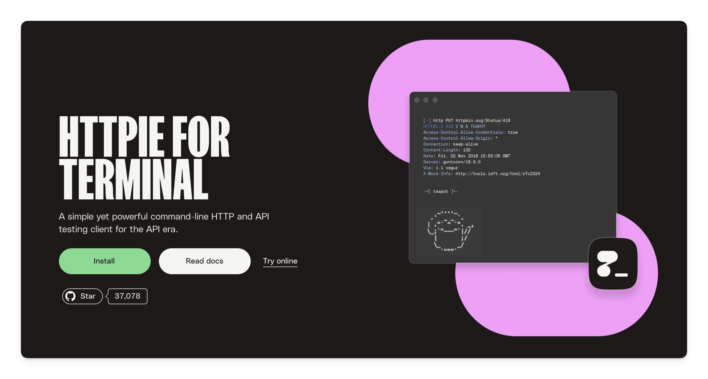

# 快速开始

## 极简步骤

首先让大家快速感受一下 Spring AI 从 0 到 1 接入聊天模型的步骤:

::: code-group

```sh [sh:创建项目]
http --download --output spring-ai-demo.zip \
  -f POST https://start.spring.io/starter.zip \
  dependencies=web,spring-ai-openai \
  bootVersion=3.5.8 \
  javaVersion=17 \
  type=maven-project
  
unzip spring-ai-demo.zip -d spring-ai-demo
cd spring-ai-demo
```

```sh [sh:创建 Controller]
cat > src/main/java/com/example/demo/AiController.java << 'EOF'
package com.example.demo;

import org.springframework.ai.chat.client.ChatClient;
import org.springframework.ai.openai.OpenAiChatModel;
import org.springframework.web.bind.annotation.GetMapping;
import org.springframework.web.bind.annotation.RequestParam;
import org.springframework.web.bind.annotation.RestController;

@RestController
public class AiController {
    private final ChatClient chat;

    public AiController(OpenAiChatModel model) {
        this.chat = ChatClient.create(model);
    }

    @GetMapping("/chat")
    public String chat(@RequestParam String q) {
        return chat.prompt().user(q).call().content();
    }
}
EOF
```

```sh [sh:运行项目]
export SPRING_AI_OPENAI_API_KEY=$QIANWEN_API_KEY
export SPRING_AI_OPENAI_BASE_URL=https://dashscope.aliyuncs.com/compatible-mode
export SPRING_AI_OPENAI_CHAT_OPTIONS_MODEL=qwen2.5-14b-instruct

./mvnw spring-boot:run
```

```sh [sh:测试项目]
http GET localhost:8080/chat q=="how are you"

---
HTTP/1.1 200
Connection: keep-alive
Content-Length: 140
Content-Type: text/plain;charset=UTF-8
Date: Tue, 25 Nov 2025 13:22:27 GMT
Keep-Alive: timeout=60

Thank you for asking! I'm just a computer program, so I don't have feelings, but I'm here and ready to assist you. How can I help you today?
```

:::

## 环境准备

其实要把上面的代码跑起来, 还需要一些必要的环境准备工作:

1. JDK 至少要 17 吧, 后续所有示例将全部使用 JDK25;
2. 使用  `HTTPie`  代替 `curl`, 前者提供更简洁的语法, 所以需要提前安装: `brew install httpie`;
3. 示例使用 `OpenAI API`, 且使用通义千问的接口, 所以你应该准备一个通义千问的 `API_KEY`, 并提前配置到环境变量: `QIANWEN_API_KEY`;
   > 一般为了避免暴露敏感信息, 不会直接将 `API_KEY` 写到代码或配置文件中, 比较推荐的方式是使用环境变量.
4. 选择一个非思考模型, 比如 `xxx-instruct`, 思考模型在非流式模式下会报错, 这个我们后面的章节细说;
5. 使用环境变量代替 `application.yml` 配置;

---

## 示例说明

### 创建项目

```sh [sh:创建项目]
http --download --output spring-ai-demo.zip \
  -f POST https://start.spring.io/starter.zip \
  dependencies=web,spring-ai-openai \
  bootVersion=3.5.8 \
  javaVersion=17 \
  type=maven-project
```

说实话, `start.spring.io` 用的确实不多, 公司内部基本上都有自己的基础框架. 不过今天还是学到了, `start.spring.io` 也支持通过接口来创建项目.

| 参数                        | 可选值                                                          | 说明                |
|---------------------------|--------------------------------------------------------------|-------------------|
| `type`                    | `maven-project` / `gradle-project` / `gradle-project-kotlin` | 构建工具              |
| `language`                | `java` / `kotlin` / `groovy`                                 | 指定主要编程语言          |
| `bootVersion`             | `3.5.8` / `3.5.9-SNAPSHOT` 等                                 | Spring Boot 版本    |
| `packaging`               | `jar` / `war`                                                | 打包类型              |
| `javaVersion`             | `25` / `21` / `17`                                           | 目标 JDK 版本         |
| `configurationFileFormat` | `yaml` / `properties`                                        | 配置文件格式            |
| `dependencies`            | `spring-ai-openai` 等                                         | 依赖列表，多个使用逗号分隔     |
| `baseDir`                 | `demo` 等任意目录名                                                | 压缩包解压后的根目录        |
| `groupId`                 | `com.example`                                                | Maven Group ID    |
| `artifactId`              | `demo`                                                       | Maven Artifact ID |
| `name`                    | `demo`                                                       | 项目名               |
| `description`             | `Demo project for Spring Boot`                               | 项目描述              |
| `packageName`             | `com.example.demo`                                           | 主包名               |

可以通过 [https://start.spring.io/metadata/client](https://start.spring.io/metadata/client) 获取所有可选值，其中 `dependencies` 字段会列出完整依赖清单。

更多命令行参数示例参考官方文档：
[https://github.com/spring-io/start.spring.io](https://github.com/spring-io/start.spring.io/blob/main/USING.adoc#Command-line-support)

### 创建 Controller

```sh [sh:创建 Controller]
cat > src/main/java/com/example/demo/AiController.java << 'EOF'
package com.example.demo;

import org.springframework.ai.chat.client.ChatClient;
import org.springframework.ai.openai.OpenAiChatModel;
import org.springframework.web.bind.annotation.GetMapping;
import org.springframework.web.bind.annotation.RequestParam;
import org.springframework.web.bind.annotation.RestController;

@RestController
public class AiController {
    private final ChatClient chat;

    public AiController(OpenAiChatModel model) {
        this.chat = ChatClient.create(model);
    }

    @GetMapping("/chat")
    public String chat(@RequestParam String q) {
        return chat.prompt().user(q).call().content();
    }
}
EOF
```

这里面最核心的就是 `OpenAiChatModel`, 因为 `dependencies=web,spring-ai-openai` 其实包含了 `spring-ai-starter-model-openai` 这个依赖, 所以能够自动注入 `OpenAiChatModel`.

然后通过高度抽象的 `ChatClient` 来调用 `OpenAiChatModel` 获取结果.

#### 链式调用

```java [java]
chat.prompt().user(q).call().content()
```

这样的代码在 Spring AI 中很常见, 优雅至极.

### 运行项目

```sh [sh:运行项目]
export SPRING_AI_OPENAI_API_KEY=$QIANWEN_API_KEY
export SPRING_AI_OPENAI_BASE_URL=https://dashscope.aliyuncs.com/compatible-mode
export SPRING_AI_OPENAI_CHAT_OPTIONS_MODEL=qwen2.5-14b-instruct

./mvnw spring-boot:run
```

示例中使用环境变量优先级高于 `application.yml` 这一特性绕过在 `application.yml` 中添加配置的操作步骤.

> 正好复习一下 Spring Boot 的配置优先级(从低到高):
>
> 1. 默认属性（通过设置指定`SpringApplication.setDefaultProperties`）
> 2. [`@PropertySource`](https://docs.spring.io/spring-framework/docs/6.1.1/javadoc-api/org/springframework/context/annotation/PropertySource.html)类上的注解。请注意，此类属性源只有在应用程序上下文刷新时`@Configuration`才会添加到 `<property>` 中。此时配置某些属性（例如 `<property>`和 ` <property>`）为时已晚，因为这些属性会在刷新开始前读取Environment``logging.*``spring.main.*`
> 3. 配置数据（例如`application.properties`文件）
>    1. jar 文件中的 `application.properties` 或 yaml
>    2. jar 文件中的 `application-{profile}.properties` 或 yaml
>    3. 打包的 jar 文件之外 `application.properties` 或 yaml
>    4. 打包的 jar 文件之外 `application-{profile}.properties` 或 yaml
>    5. **如果在同一位置的配置文件中同时存在 .properties 和 yaml 格式，.properties 优先级更高**
> 4. `RandomValuePropertySource`仅在以下情况下具有属性`random.*`的A
> 5. 操作系统环境变量
> 6. Java 系统属性（`System.getProperties()`）
> 7. 来自 JNDI 的属性`java:comp/env`
> 8. `ServletContext`初始化参数
> 9. `ServletConfig`初始化参数
> 10. `SPRING_APPLICATION_JSON`来自（嵌入在环境变量或系统属性中的内联 JSON）的属性
> 11. 命令行参数
> 12. `properties`在测试中使用属性。可在测试[`@SpringBootTest`](https://docs.spring.io/spring-boot/docs/3.2.0/api/org/springframework/boot/test/context/SpringBootTest.html)注解中 [用于测试应用程序的特定部分](https://docs.spring.io/spring-boot/docs/3.2.0/reference/html/features.html#features.testing.spring-boot-applications.autoconfigured-tests)
> 13. [`@DynamicPropertySource`](https://docs.spring.io/spring-framework/docs/6.1.1/javadoc-api/org/springframework/test/context/DynamicPropertySource.html)在测试中添加注解
> 14. [`@TestPropertySource`](https://docs.spring.io/spring-framework/docs/6.1.1/javadoc-api/org/springframework/test/context/TestPropertySource.html)在测试中添加注释
> 15. `$HOME/.config/spring-boot`devtools处于活动状态时，目录中的 [devtools 全局设置属性](https://docs.spring.io/spring-boot/docs/3.2.0/reference/html/using.html#using.devtools.globalsettings)

---

Spring Boot 能够自动将 `SPRING_AI_OPENAI_BASE_URL` 这类环境变量映射为 `spring.ai.openai.base-url`.

考官方文档：[Spring Boot Externalized Configuration](https://docs.spring.io/spring-boot/docs/3.2.0/reference/html/features.html#features.external-config.typesafe-configuration-properties.relaxed-binding.environment-variables)

> **环境变量映射规则**:
>
> 1. 全大写 → 小写
> 2. `_` → `.`
> 3. `__` → `-`

---

## 辅助工具

- 值得一试的 [HTTPie](https://httpie.io/)，提供比 `curl` 更友好的命令行体验.


